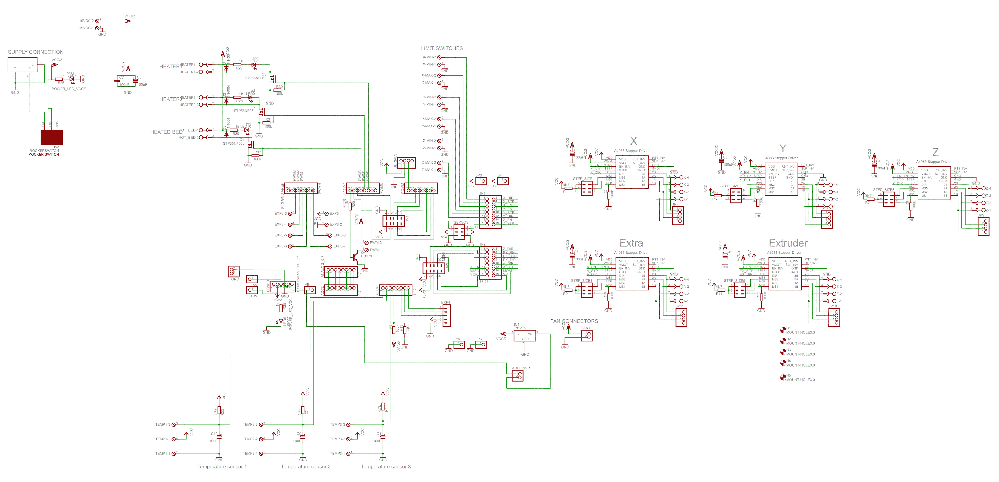

# UMO-1.75mm

Upgrade the Ultimaker Original to use 1.75 mm filaments.

WIP

---

## **Bill of Materials (BOM)**
- **Extruder**: [Product Link](https://www.amazon.fr/dp/B09H6T3NNT?ref=ppx_yo2ov_dt_b_fed_asin_title&th=1)
- **HotEnd**: [Product Link](https://www.amazon.fr/dp/B09RXRQ5HM?ref=ppx_yo2ov_dt_b_fed_asin_title&th=1)

**Required Modification**:
- Solder a **4.7k ohm resistor** to the **R23** position on the mainboard.



---

3D files - forked from am001 : [E3D Hotend mount for Ultimaker](https://www.thingiverse.com/thing:94678/files)
Original files from ultimaker : [Ultimaker Original BOM](https://github.com/Ultimaker/UltimakerOriginal/tree/master)

---

## **Compiling Marlin Firmware**

Use **Arduino IDE 1.x** to compile and flash Marlin.

### Changes in `Configuration.h`:

- Configure the temperature sensor:
  ```c
  #define TEMP_SENSOR_0 1 
  // 1 is a 100k thermistor - ideal for EPCOS 100k (with a 4.7k pullup resistor)
  ```

---

## **Temperature Tests**

Before proceeding, test the temperature sensor functionality:

1. Send the following command via a G-code terminal:
   ```gcode
   M109 S50
   ```
2. Check if the temperature increases when the hotend is heated.

---

## **Hotend PID Calibration**

Perform PID auto-tuning to optimize heating performance:

1. Run the following command:
   ```gcode
   M303 E0 S200 C8
   ```
2. Record the results (Kp, Ki, Kd). For example:
   ```
   Kp: 47.02
   Ki: 5.48
   Kd: 100.91
   ```
3. Update these values in `Configuration.h`:
   ```c
   #define DEFAULT_Kp 47.02
   #define DEFAULT_Ki 5.48
   #define DEFAULT_Kd 100.91
   ```

---

## **Setting Steps per mm (e-steps)**

Calibrate the extruder to ensure proper extrusion:

1. Set the e-steps value. For me, the value was:
   ```gcode
   M92 E140
   M500
   ```
   > **Note**: Adjust this value according to your setup if needed.

2. Test the extruder movement:
   - Extrude 10 mm of filament:
     ```gcode
     G1 E10 F100
     ```
   - Retract 10 mm:
     ```gcode
     G1 E-10 F800
     ```

---

## **Important Notes**

- Ensure the hotend is properly heated before extruding or retracting filament.

---

With these steps, your Ultimaker Original is ready to work with 1.75 mm filaments. If you encounter any issues or have questions, feel free to share your experience!
