# UMO-1.75mm

The Ultimaker Original, released in 2011, was my first personal 3D printer. I received it at the end of 2012 and used it without major issues until 2020. However, after that, several challenges arose:

- All my other printers used 1.75 mm filament, and I no longer wanted to manage two separate filament stocks due to insufficient throughput.
- The hotend of my Ultimaker Original started to show its age, and high-quality replacement parts were either unavailable or too expensive.
- The extruder had become almost unusable and suffered from the same supply issues as the hotend.
- Determined to keep this fantastic machine running—still capable, I’m sure, of producing quality prints—I decided to modify it to use standard Ender 3 parts and transition to 1.75 mm filament.

The goal of this repository is to share this journey with you and maybe even inspire you to try it yourself if you're interested! 😊

*This project is still a Work in Progress.*

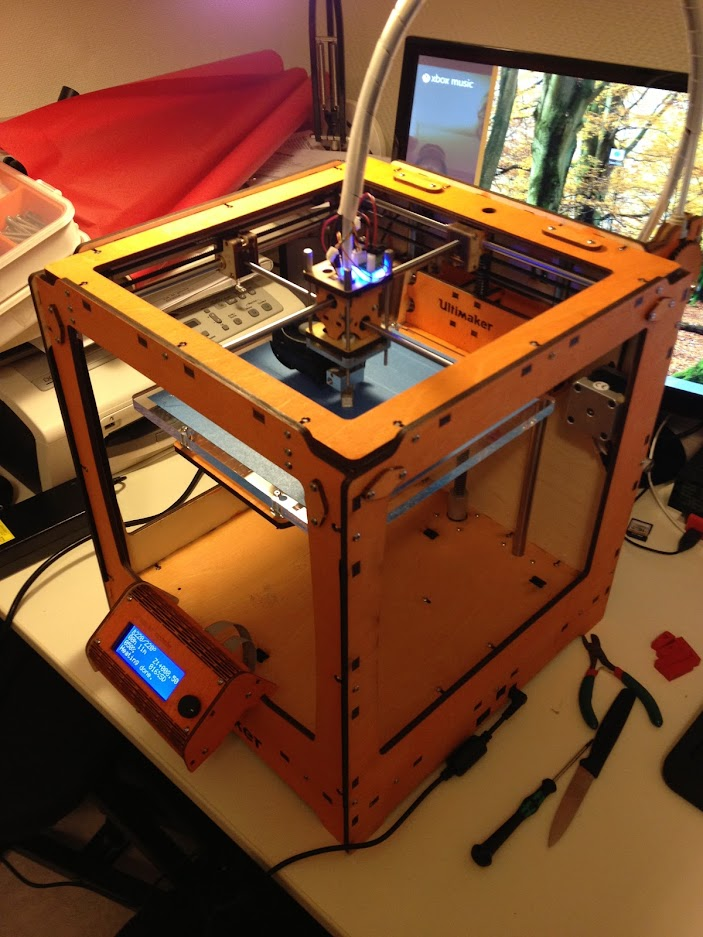
*My Ultimaker Original in early 2013*

---

## **Bill of Materials (BOM)**

To modify my Ultimaker, I used the materials listed below. They are fairly standard and readily available online.

- **Extruder**: [Product Link](https://www.amazon.fr/dp/B09H6T3NNT?ref=ppx_yo2ov_dt_b_fed_asin_title&th=1)
- **HotEnd**: [Product Link](https://www.amazon.fr/dp/B09RXRQ5HM?ref=ppx_yo2ov_dt_b_fed_asin_title&th=1)

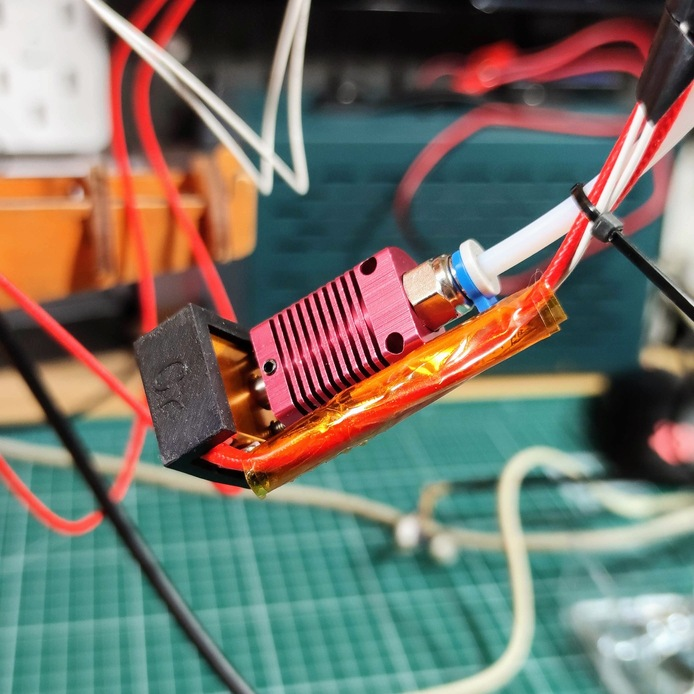
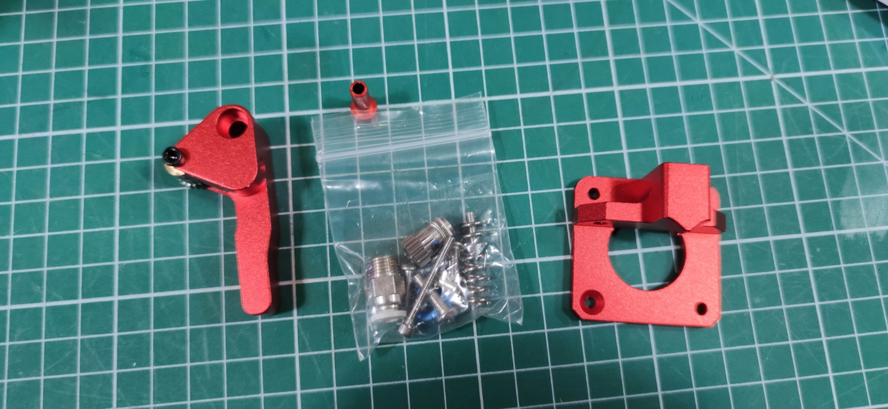

You will also need a 40x40 fan to cool the print head and prevent clogging in the PTFE tube. In my case, I had a fan from an Ender 2 Pro among my spare parts, but any fan of the same type will work.

You will also need a 4.7K ohm resistor to solder onto the board (along with a soldering iron) and Molex KK254 connectors if you prefer not to cut and modify the existing sensor cable.

Regarding the resistor, it is recommended to use a high-precision resistor if you want to improve the accuracy of temperature readings. However, for initial testing, a resistor with 5% tolerance will do the job. It will be soldered to the **R23** position on the mainboard.


To help you, you can also take a look at the BOM from Ultimaker Repo :

- Original files from ultimaker : [Ultimaker Original BOM](https://github.com/Ultimaker/UltimakerOriginal/tree/master)

---

### **Removing the Original Print Head and Extruder**

**Note:** In my case, I had already attempted a modification of the extruder. The version I have is therefore slightly different. I’ll use this version to temporarily attach the new extruder while I design a proper *Ultimaker-style* replacement.

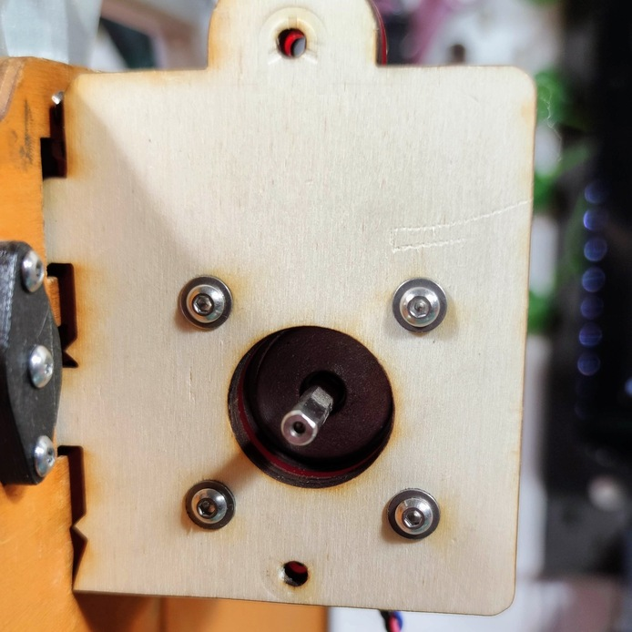

#### **Steps to Disassemble the Print Head**

1. **Disconnect the heater cartridge wires**:
   
   Begin by unscrewing the connections for the heater cartridge from the mainboard. Keep the existing sensor cable intact, as it will later be repurposed for the print fan. While you're at it, disconnect the temperature sensor wires as well.

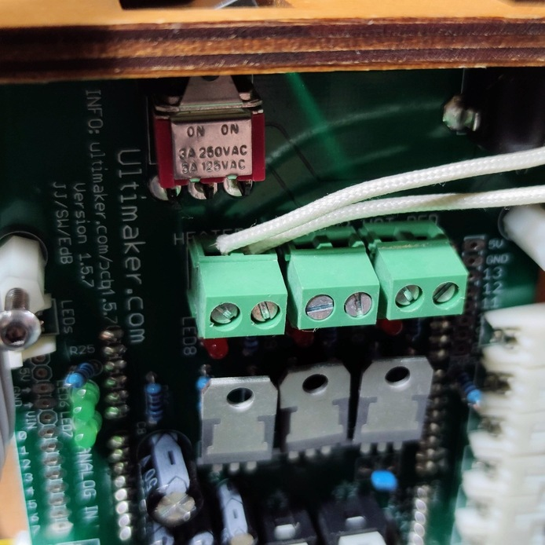  
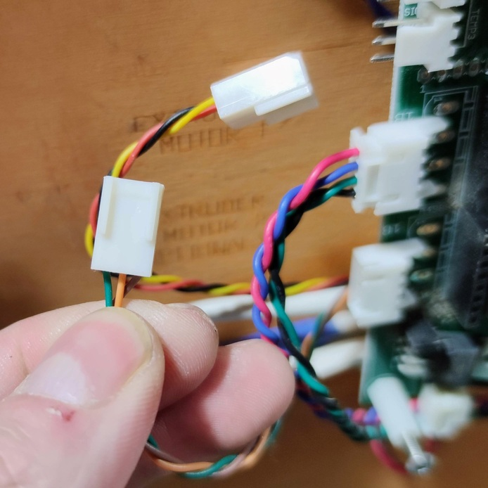

2. **Remove the print head carefully**:
   
   You can now cautiously disassemble the print head. Be sure to keep all components, as you might want to reassemble them later. In my case, I decided to take everything apart individually because I wasn’t sure how the reassembly would go. Initially, I planned to reuse the original heater cartridge and sensor.  

   Unfortunately, the head was in such poor condition that this became impossible, and the head connector broke into two pieces.  

   **Pro Tip:** Try to handle the disassembly more neatly than I did! 😊

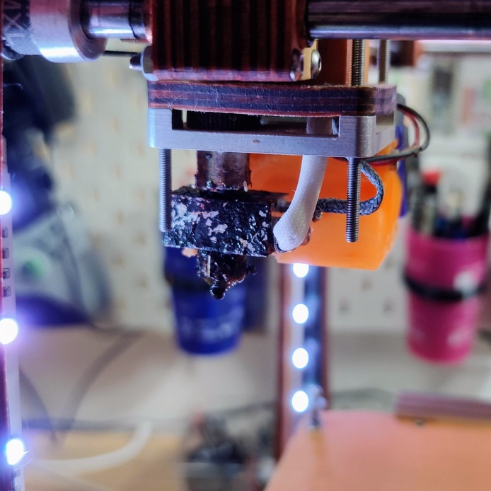
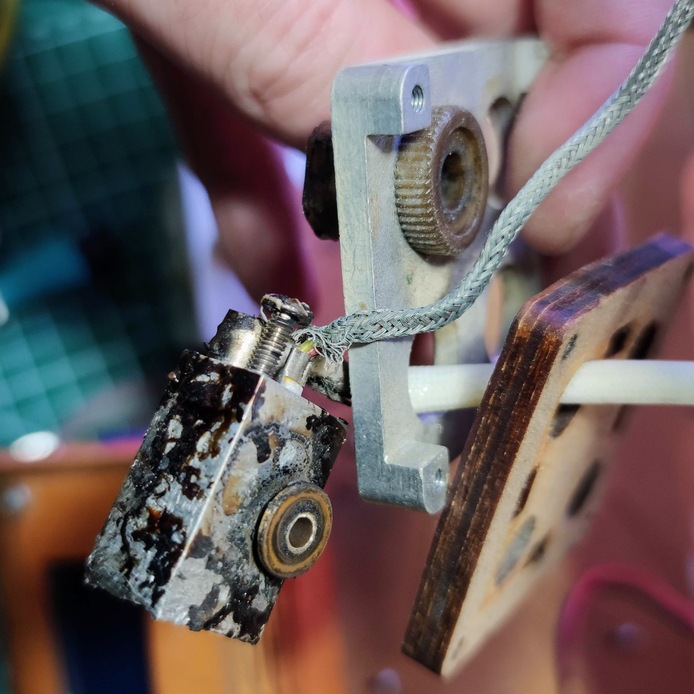
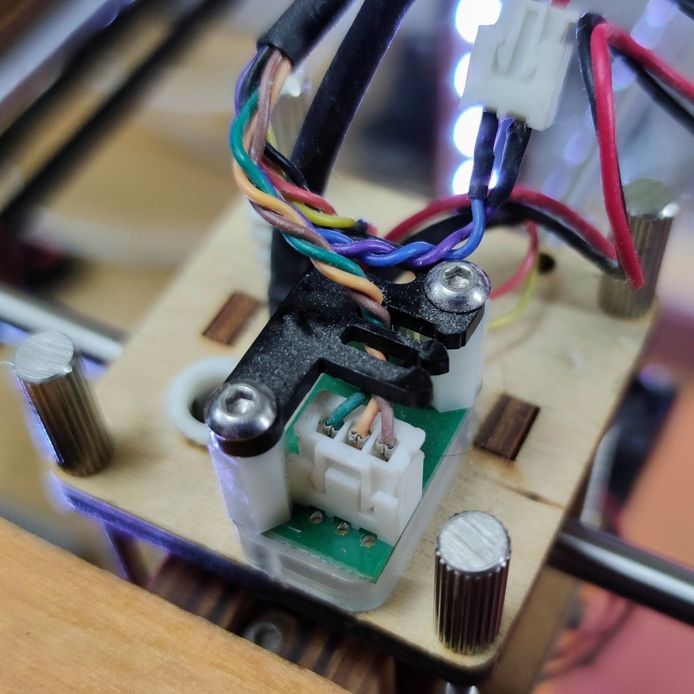
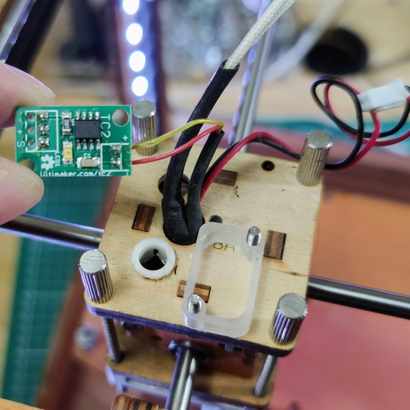
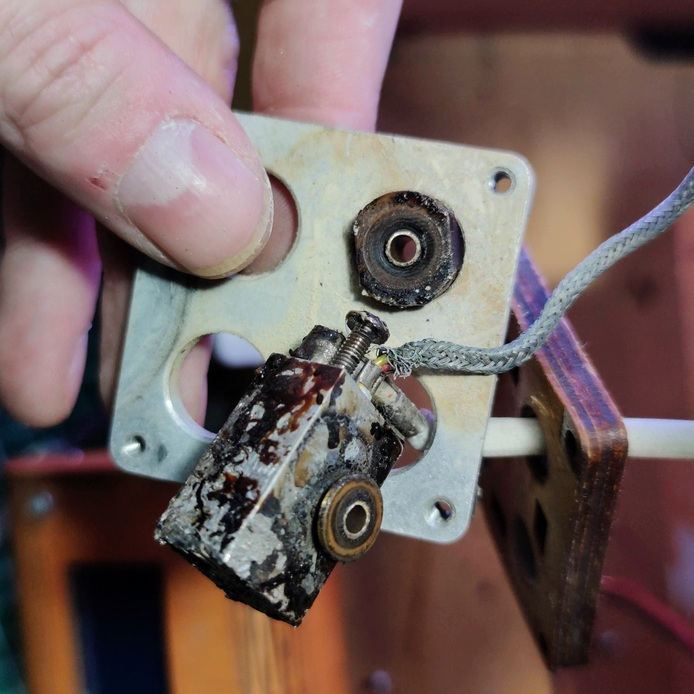

#### **Assembling the Extruder**

In this case, there isn’t much to explain. The motor is compatible with the extruder, making the modification relatively straightforward. You’ll just need a mounting plate to secure the assembly. The original plate will do the job if you still have it.


#### **Cable Routing**

Now, route all the cables from the new print head through the original cable path. You should have two wires for the heater cartridge and two wires for the temperature sensor.


**Note:** I’ve always been a bit skeptical about the cable routing and cable management on this machine. While using nylon fabric sleeves for the cable bundle is a great idea, the management underneath is a real mess. 😅 I’ll have to address it properly one of these days.

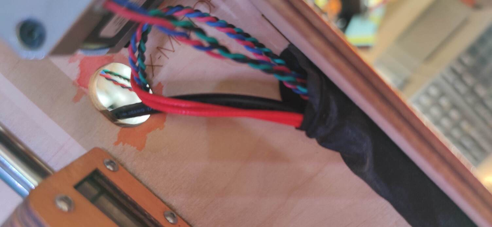  
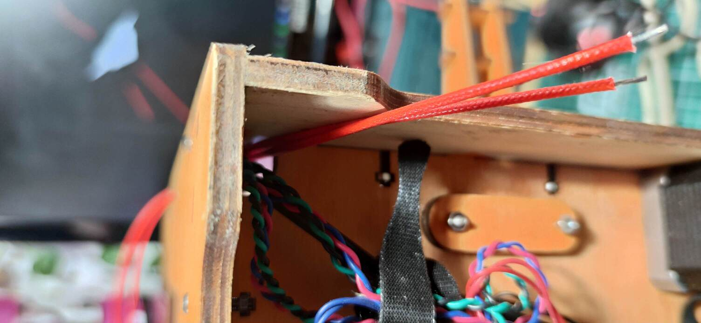

Connect the heater cartridge wires to the same spot on the board as the original cartridge. The polarity doesn’t matter.  

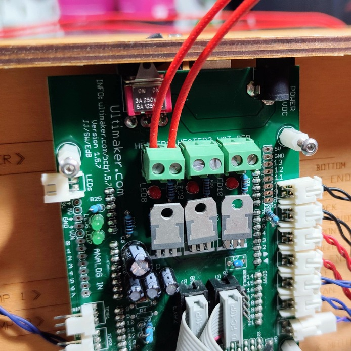

#### **Soldering the 4.7K Resistor**

Next, solder the 4.7K ohm resistor. If you’re feeling ambitious, you can unplug everything, remove the board, and solder the resistor "properly" through the PCB. However, for initial testing, you can shape the resistor as shown in the photo and solder it "on the surface." This approach is fine for now, especially if you're using a 5% tolerance resistor and plan to replace it later with a more precise one.

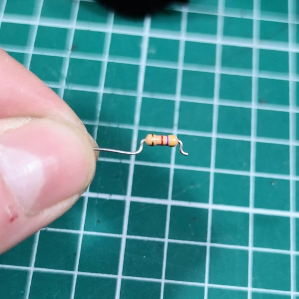  
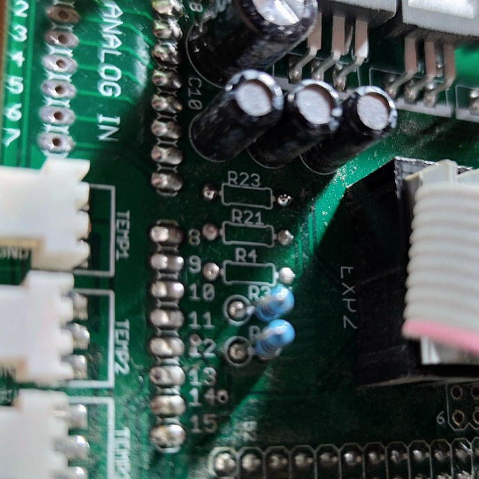  
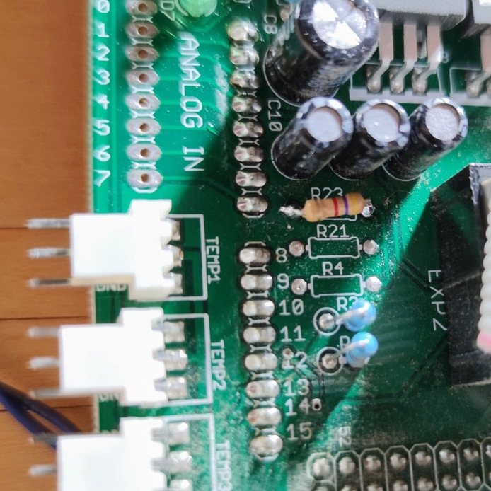

#### **Creating a Sensor Connector**

Next, create a connector for the temperature sensor. Use a Molex KK254 connector and connect the sensor to the **GND** and **SIG** pins at the ends. Then, plug the connector into the board at the **TEMP1** slot.

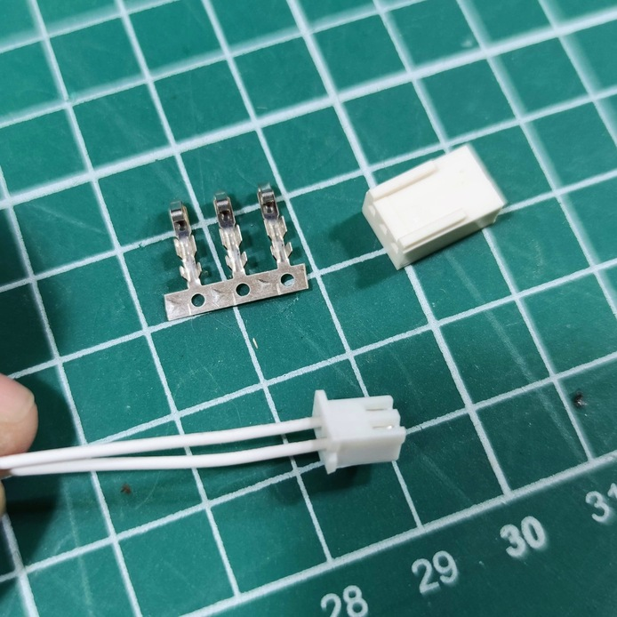  
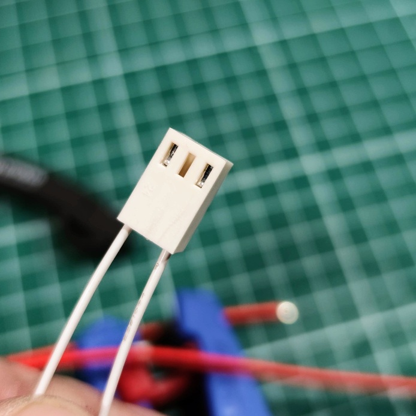  
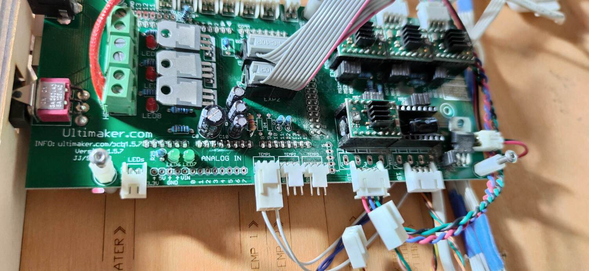

#### **Adding the Print Head Fan**

This wasn’t a feature on the original machines, but later on, cooling the hotend became essential to prevent filament clogging. For this, you can use a 40x40 mm 24V fan and connect it to the cooling fan port on the board. Since the fan needs to be always on, there’s no need for a specific input.  

Take advantage of having the board accessible to complete this connection and route your fan cables.  

**NOTE:** I didn’t take photos of this step but will add them later.  

#### **Test Assembly**

If you have leftover parts, you can set up a temporary assembly, as I did, to test your connections. In this case, I used some old parts from an Ender 2 Pro to mount the fan and the print head for initial tests.

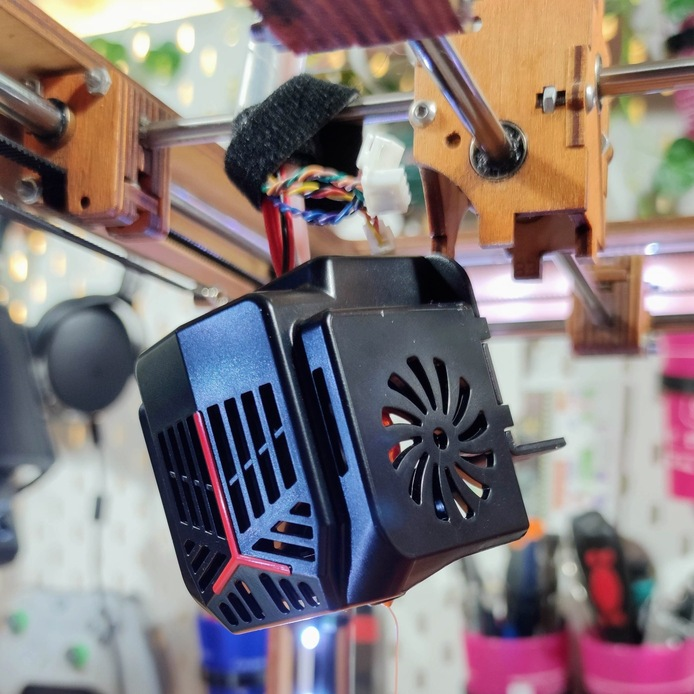  

---

## **Compiling Marlin Firmware**

Use **Arduino IDE 1.x** to compile and flash Marlin.

### Changes in `Configuration.h`:

- Configure the temperature sensor:
  ```c
  #define TEMP_SENSOR_0 1 
  // 1 is a 100k thermistor - ideal for EPCOS 100k (with a 4.7k pullup resistor)
  ```

---

## **Temperature Tests**

Before proceeding, test the temperature sensor functionality:

1. Send the following command via a G-code terminal:
   ```gcode
   M109 S50
   ```
2. Check if the temperature increases when the hotend is heated.

---

## **Hotend PID Calibration**

Perform PID auto-tuning to optimize heating performance:

1. Run the following command:
   ```gcode
   M303 E0 S200 C8
   ```
2. Record the results (Kp, Ki, Kd). For example:
   ```
   Kp: 47.02
   Ki: 5.48
   Kd: 100.91
   ```
3. Update these values in `Configuration.h`:
   ```c
   #define DEFAULT_Kp 47.02
   #define DEFAULT_Ki 5.48
   #define DEFAULT_Kd 100.91
   ```

---

## **Setting Steps per mm (e-steps)**

Calibrate the extruder to ensure proper extrusion:

1. Set the e-steps value. For me, the value was:
   ```gcode
   M92 E140
   M500
   ```
   > **Note**: Adjust this value according to your setup if needed.

2. Test the extruder movement:
   - Extrude 10 mm of filament:
     ```gcode
     G1 E10 F100
     ```
   - Retract 10 mm:
     ```gcode
     G1 E-10 F800
     ```

---

## **Important Notes**

- Ensure the hotend is properly heated before extruding or retracting filament.

---

With these steps, your Ultimaker Original is ready to work with 1.75 mm filaments. If you encounter any issues or have questions, feel free to share your experience!
